# 환경
- Windows 10, NVIDIA GeForce GTX 1660, Intel i5-10400, RAM 16GB
- VScode(IDE)
-	Anaconda(Virtual Environment)
-	Python 3.7.13
- scipy, six, piglet
-	Open ai Gym
-	Atari-py [1]
-	MSYS2 (<http://www.msys2.org/>)
	아타리 게임(브레이크아웃 등)을 실행시키기 위한 윈도우 환경에서 GNU 툴을 이용하기 위한 환경
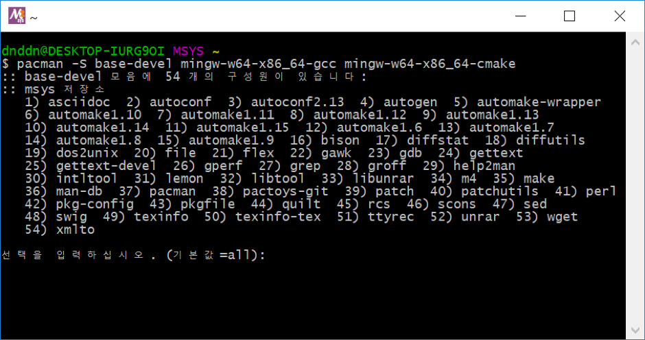
```bash
  $ pacman -S base-devel mingw-w64-x86_64-gcc mingw-w64-x86_64-cmake
```

   
# 구현[2]
[3]<https://github.com/limetimeline/Atari-DQN>

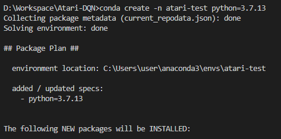   
아나콘다로 atari-test라는 가상환경을 만들어준다. 파이썬 버전은 ``3.7.13``으로 한다.   

```bash
  conda create -n atari-test python=3.7.13
```   

   
이제 생성한 ``가상환경을 활성화`` 시켜준다.   

```bash
  conda activate atari-test
```

   
``Spicy`` 라이브러리를 설치한다.   

```bash
  pip install spicy
```

   
``Six`` 라이브러리를 설치한다.   

```bash
  pip install six
```

   
``Piglet`` 라이브러리를 설치한다.   

```bash
  pip install piglet
```
   
``Gym`` 라이브러리도 설치한다.  

```bash
  pip install gym
```
   
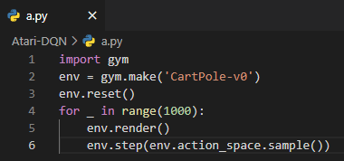  
앞에서 라이브러리들이 잘 설치되었는지 확인해보는 코드를 작성해보자.   
gym 라이브러리에 기본적으로 탑재되어 있는 CartPole게임을 실행해보자.   

```python
import gym
env = gym.make('CartPole-v0')
env.reset()
for _ in range(1000):
    env.render()
    env.step(env.action_space.sample())
```

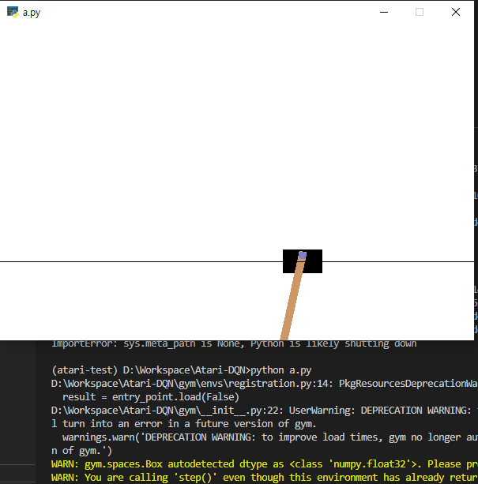   
이렇게 ``CartPole`` 게임이 잘 나오는 것을 확인할 수 있다.
   

- 시스템 환경 변수 편집

1.	``(시스템 변수) 변수 이름 : DISPLAY, 변수 값 : 0``

 
2.	``(시스템 변수) Path 변수 편집 – MSYS2 경로 추가``
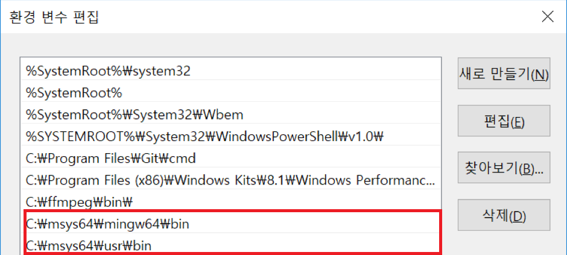
 

   
``Atary-py`` 라이브러리를 설치한다.   

```bash
  pip install atary-py
```   

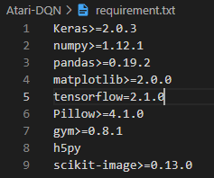   
``Requirement.txt``에 기록된 필수 라이브러리들이다.   
특히 나중에 GPU(Graphic Card)를 쓰려면 Nvidia의 Cuda버전과 Tensorflow버전이 같아야 하므로 주의하자! 여기서는 2.1.0버전을 사용하였다.   

   
필수 라이브러리들을 설치한다.   

```bash
  pip install -r requirement.txt
```   

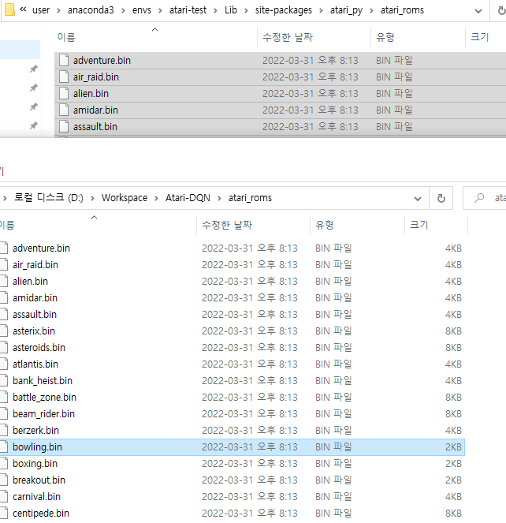    
Github에 있는 ``Atari_roms`` 안에 있는 파일들을 다 복사한다.   
그후 지금 사용하고 있는 아나콘다 가상환경인 atari-test 폴더의 ``Lib – site-packages – atari_py – atari_roms`` 안에 복사한 롬파일을 모두 넣자. (이제 아타리 게임들을 실행할 수 있다!)
   
- GPU 사용하기

   
``텐서플로`` 버전이 ``2.1.0``이다.

   
<https://www.tensorflow.org/install/source_windows#tested_build_configurations>   
텐서플로 버전과 그에 상응하는 ``cuDNN``과 ``CUDA``버전을 파악하자. 여기서는 각각 ``7.6``, ``10.1``버전이다.

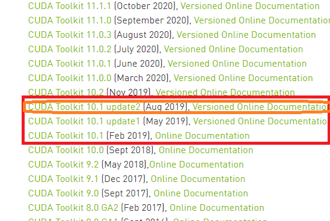   
<https://developer.nvidia.com/cuda-toolkit-archive>   
 CUDA버전 10.1을 다운받아 설치하자.

   
<https://developer.nvidia.com/rdp/cudnn-archive>   
cuDNN을 다운받고 압축을 풀자.

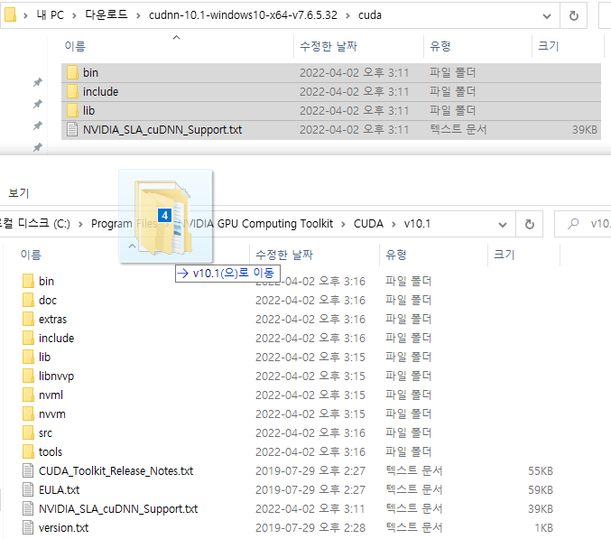   
설치된 CUDA 폴더에 다운받아 압축을 푼 cuDNN 안의 파일들을 다 복사하여 붙여넣자.

   
CMD를 열어 확인해보면 자동으로 ``환경변수``가 등록이 되어있다.   
위와 같이 나온다면 성공적으로 설치가 된 것이다.

```bash
  nvcc --version
```
   

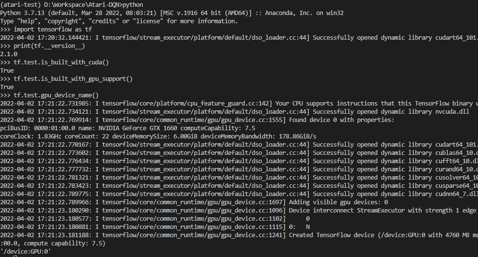   
``텐서플로 버전과 CUDA 설치 여부, GPU 지원(인식) 여부, GPU정보``가 잘 나오는 것을 볼 수 있다.   

```python
  import tensorflow as tf # 텐서플로 임포트
  
  print(tf.__version__) # 텐서플로 버전
  tf.test.is_built_with_cuda() # CUDA 설치 여부
  tf.test.is_built_with_gpu_support() # GPU 인식 여부
  tf.test.gpu_device_name() # GPU 정보
```   

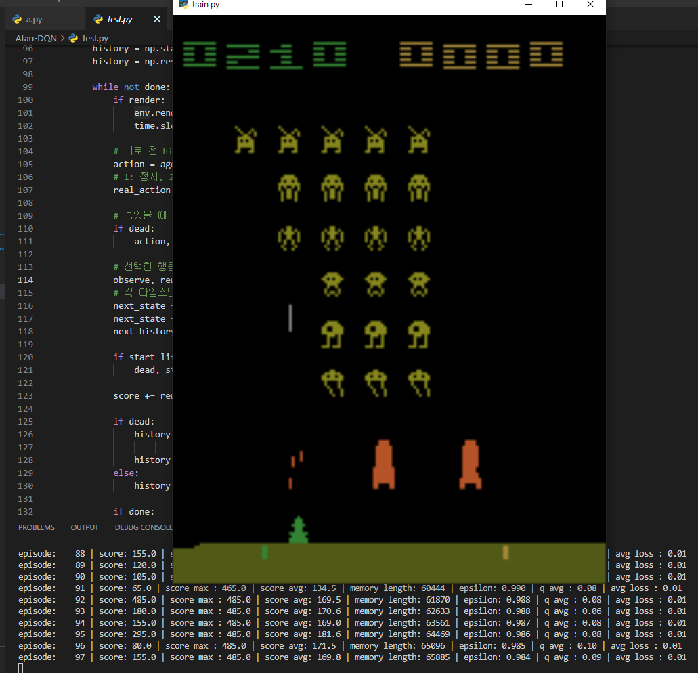   
SpaceInvaders를 플레이하고 있는 모습이다.   
atari-dqn모델은 웬만한 아타리 게임들에 적용이 가능하다.   
원래 breakout으로 되어 있었는데 바꿨다.

   
학습하고 있는 모습이다.
   
breakout과 SpaceInvaders 외의 ``Atari game`` 들이 잘 되는 것을 볼 수 있다.
   
# 참고  
[1] <https://github.com/youngwoon/transition>  
[2] <https://github.com/rlcode/reinforcement-learning-kr-v2/blob/master/wiki/install_guide_window.md>  
[3] <https://github.com/limetimeline/Atari-DQN>


